# 实验-基于阿里云函数计算的邮件发送服务初步设计与部署应用

## 实验步骤

### 实验环境准备

#### 获取函数计算免费额度

点击链接进入函数计算控制台: <https://fcnext.console.aliyun.com/>

#### 创建自定义公共层，提供 Python Sanic依赖

我们知道，本地环境下可以通过 ```pip install ...``` 来安装所需要的依赖。但是FC环境下，应该将这些依赖项提炼成一个公共层，以便在多个函数之间共享，同时可以有效地减少部署和更新时的代码包大小。
在构建公共依赖层时，首先应该检查阿里云官方提供的公共层列表。如果所需的依赖已经存在于官方列表中，那么就没有必要创建自定义的公共层。在本实验中，将使用Sanic框架来编写接口。由于Sanic框架并未包含在阿里云的官方公共层列表中，因此需要创建一个自定义的公共层来满足需求。
自定义公共层创建步骤如下：

1. 浏览器访问函数计算FC 3.0控制台(https: /fcnext.console.aliyun.com)，进入 高级功能–层管理页面，点击 创建层 按钮进行创建。
2. 填写相关信息，点击创建按钮，会显示依赖层构建日志，构建完成后页面将自动跳转回层管理界面。
创建完成后，我们可以在层管理页面看到刚刚创建的公共层。
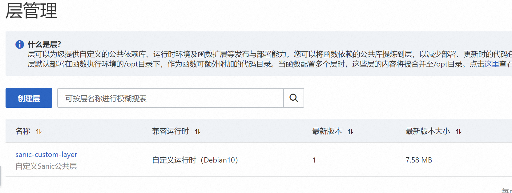

#### 构建并部署告警邮件发送接口

1. 浏览器访问函数计算FC 3.0控制台(https:/fcnext.console.aliyun.com),进入函数页面，点击创建函数|按钮进行创建。
2. 勾选web函数，在基本设置中填写函数名称“fun-alarm-email-send”，函数代码配置部分保持默认，暂时使用FC提供的示例代码(在后续步骤中会对其修改)，并点击创建按钮。

#### 基于Sanic框架编写接口代码

上一步骤中创建好函数后，页面将自动跳转至函数详情页面，并使用在线IDE打开代码。将提供的范例代码替换原示例代码app.py文件的内容。

代码修改完成后，点击IDE右上角上面的编辑层按钮，修改默认的公共层配置。先删除现有的官方公共层Flask，再点击添加层-添加自定义层按钮选择自己创建的sanic-custom-layer层，最后点击部署按钮。
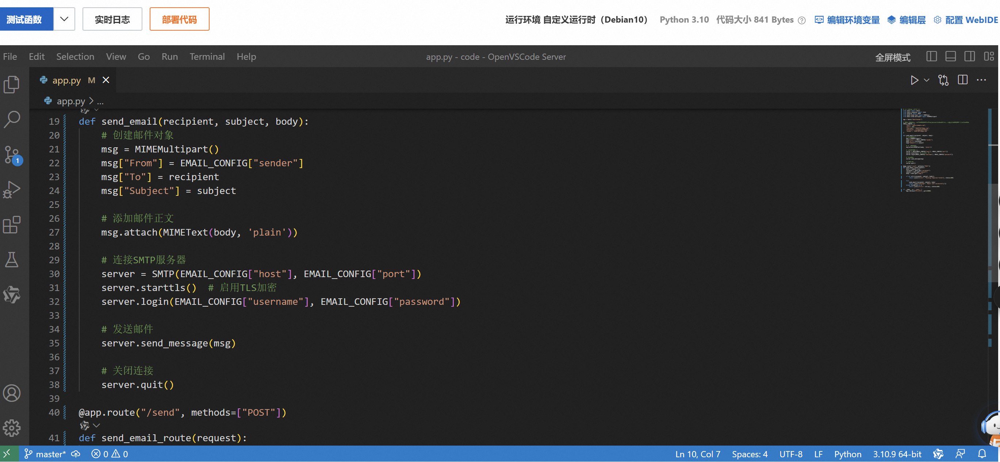
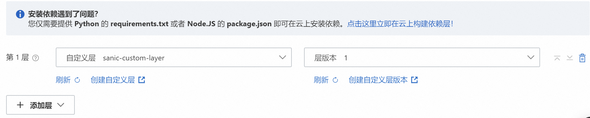
依赖层部署完成后，点击页面上的部署代码按钮，进行代码部署。
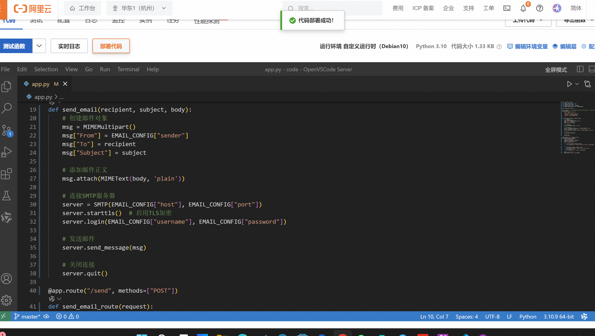

#### 获取函数外网访问地址
在函数详情页面，将光标放在触发器矩形框上，将显示公网访问的地址，该域名由 CNCF SandBox项目Serverless Devs 社区所提供,仅供学习和测试使用，社区会对该域名进行不定期地拨测，并在域名下发 30 天后进行回收，强烈推荐有条件的同学可以参考 函数计算FC控制台-域名管理 页面提示进行自定义域名配置。
(没有条件呜呜呜)

#### 开启函数日志功能(可选)【暂时没有选择开启】

开启日志功能后，可以实时查看该函数中打印到控制台日志，从而便于进行代码测试、故障分析等操作。点击IDE左上角偏上部分的实时日志 按钮，在弹出的页面中点击 一键启用 按钮开启日志服务注意:使用阿里云的日志服务SLS会产生一定的费用，详情参见日志服务计费方式(https://help.aliyun.com/zh/sls/product-overview/billable-items).

####  测试告警邮件发送接口功能

本小节采用Apifox工具进行接口测试，工具介绍参见其官方文档(<https://apifox.com/help/>)，此处不做赘述。
利用Apifox工具编写对邮件发送接口发起HTTP接口。
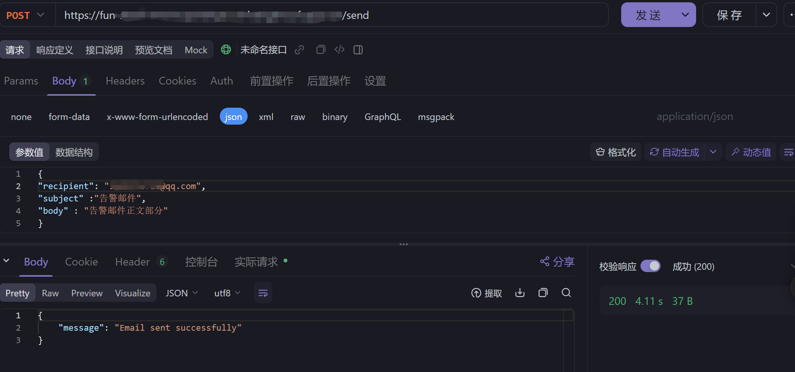
测试成功，对应的收件邮箱接收到对应告警邮件。

### 体验函数计算FC的弹性伸缩能力

进入之前创建的 ```fun-alarm-email-send``` 函数详情页面，点击实例按钮查看当前函数的实例(阿里云函数计算FC用来运行函数的最小单元，请求最终是由函数实例来进行处理的)，将发现当前不存在任何函数实例。因为按量实例(默认创建的Web函数就是按量实例)在处理完请求后会被冻结，如果一段时间内（一般为3~5分钟）不再处理请求，会自动销毁。
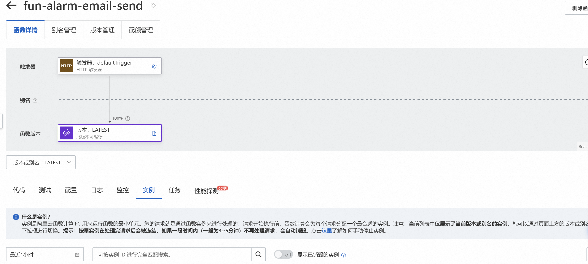
为了更直观观察到自动扩缩容的过程，可以设置函数的```单实例并发度```为较低的值，并借助Apifox工具对```邮件发送接口/send```进行压力测试。其中，单实例并发度指每个应用实例能够同时处理的请求次数上限，当单个实例的并发请求数达到上限，才会创建新的实例。
点击函数详情页面的```配置-运行时```按钮，在运行时配置展示页面点击```编辑```按钮，进入运行时的编辑页面，修改单实例并发度为2，最后点击```部署```按钮。
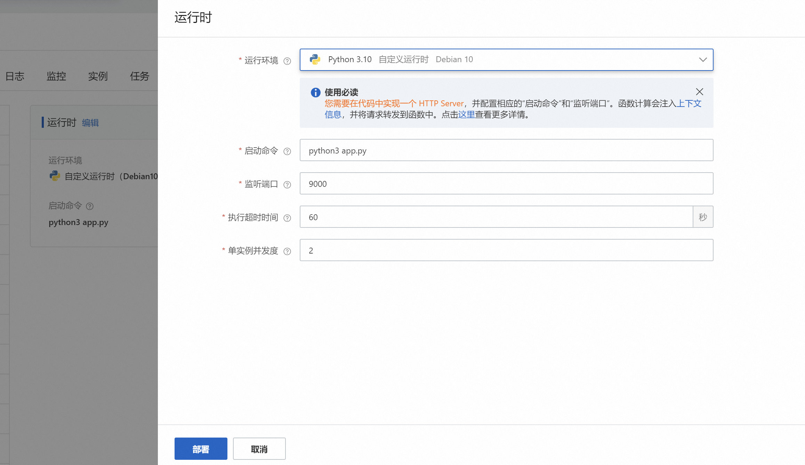

在Apifox工具上点击自动化测试按钮，并在配置页面新增测试场景。
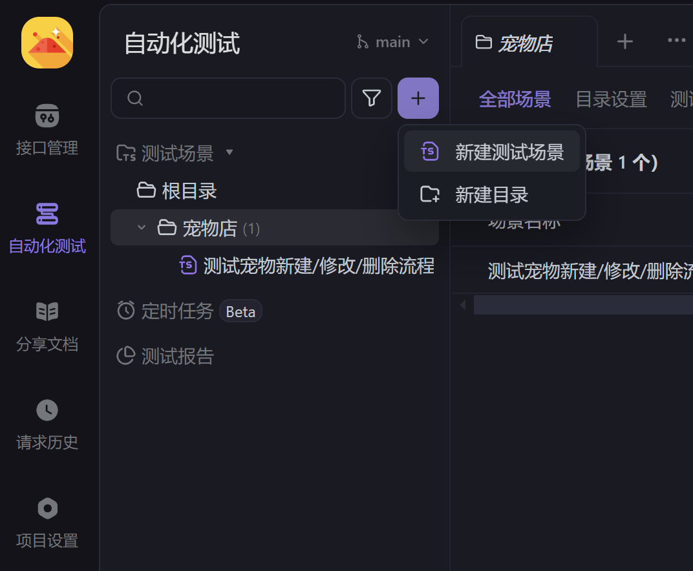
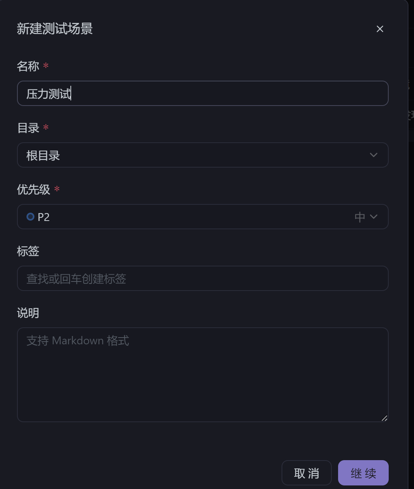
在压力测试的配置界面点击添加步骤-添加自定义请求按钮，填写请求信息，填写完成后点击保存按钮。
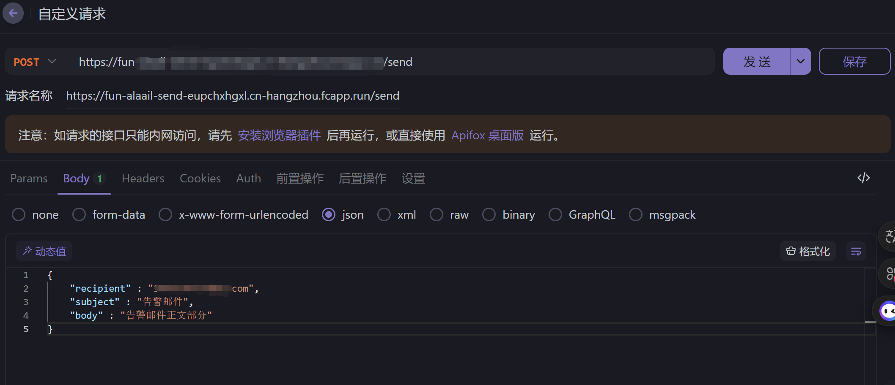
返回压力测试场景配置页面，将线程数设置为10，即同时并发执行的线程数一共10个。
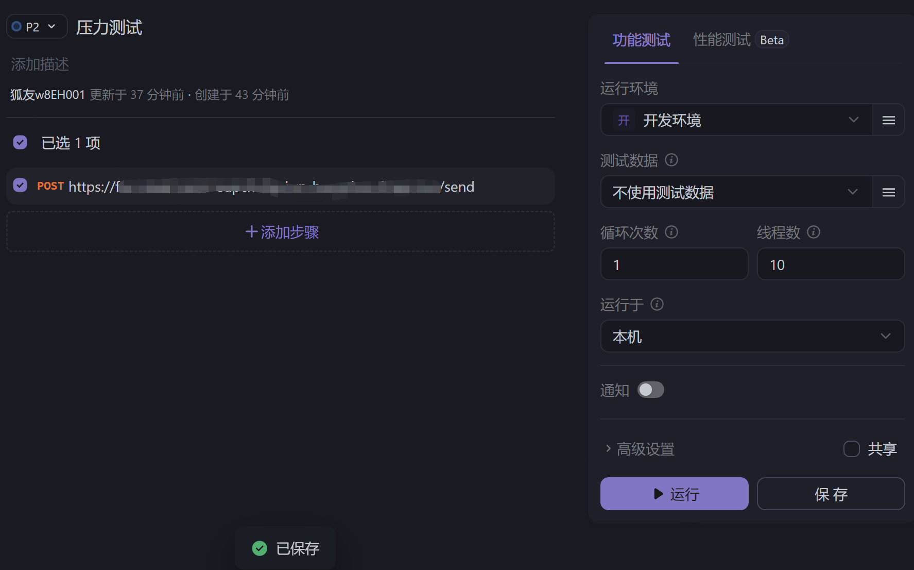
点击运行按钮（模拟请求流量波峰），监控fun-alarm-email-send函数详情页面的实例列表，将发现实例从0个快速增长至5个实例(10 /2 = 5)，等待3-5分钟后(模拟请求流量波谷),5个函数实例都将销毁。
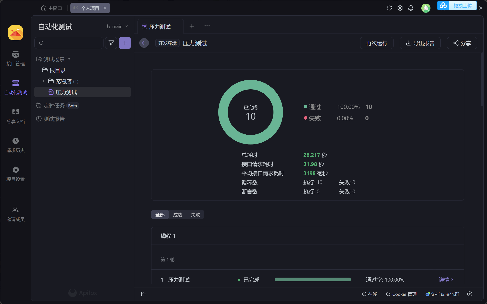

