# 基于阿里云云效Codeup的Git代码管理

## 实验环境

Ubuntu 20版本

## 实验内容及步骤

### 构建实验环境

#### 准备本地开发环境

##### 在本地环境安装Git和python3

在终端输入指令安装Git并检查是否安装成功：
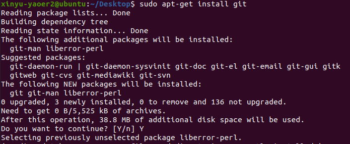
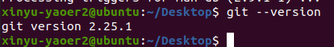

配置全局用户名与邮箱。为标识身份，在使用 Git 前，建议执行两个全局配置，即用户名与电子邮箱。当使用 Git 提交代码时，用户名和电子邮箱将被同时记录，用以标识提交者信息，推送时亦然。以本地环境Ubuntu为例，若未配置 Git 用户名与电子邮箱，提交代码后Git 记录的提交者为当前 Ubuntu 本地用户名。

```
git config --global user.name "<username>"
git config --global user.email "<email>"
```

查看配置情况，输入以下指令：

```
git config -global user.name
git config --global user.email
```
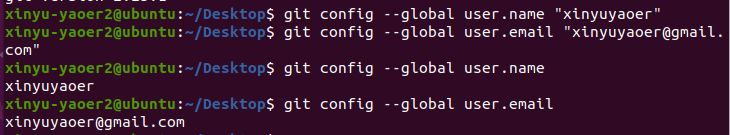

随后安装Python3和Python虚拟环境，输入以下指令：
```
sudo apt install python3
sudo apt install python3-venv
```

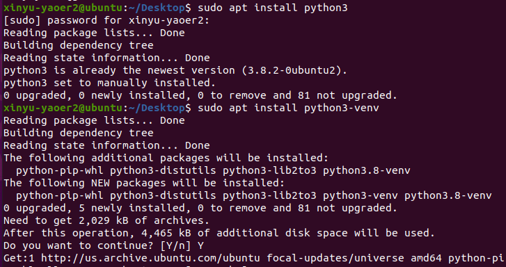

接着查看Python版本，输入以下指令：
```
python --version
```

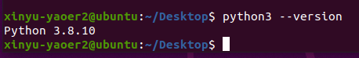

##### 在本地安装Python第三方库

进入本地工作目录 exp_pyms ，**创建 Python 虚拟环境** pyms_venv ，并**使用 source 命令激活虚拟环境**。
Python 虚拟环境可以实现为不同的项目设置独立的依赖库，以实现在统一系统中不同项目所需或者一些软件包的隔离。例如开发环境中的两个项目都依赖同一个软件包，但依赖于不同的版本，依赖是相互冲突的，那么使用 **Python 虚拟环境就能为不同的项目创建独立的虚拟环境。**
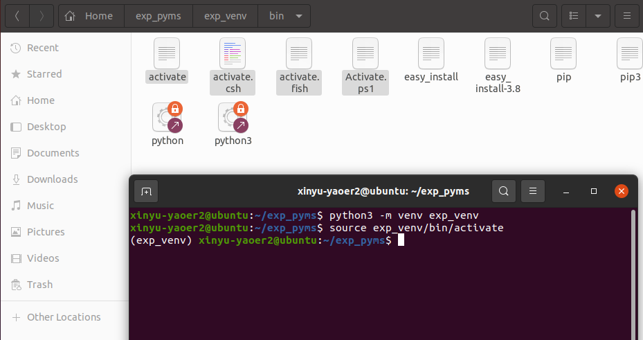

然后配置 requirement.txt 文件（需要先手动创建文件），在里面编写要安装的Python库名，如本系列实验后续会使用到的web服务器框架 sanic 、http基本库 requests 以及用于访问数据库的基础库 pymysql ,内容如下：
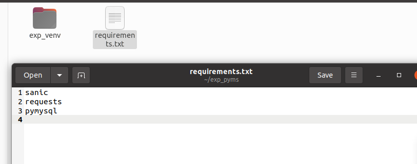
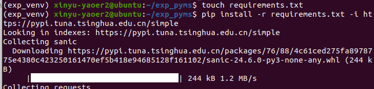
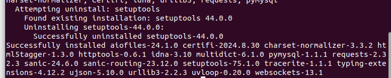
如图所示下载成功。

#### 基于阿里云云效代码管理Codeup创建代码库

##### 新建远程仓库

* 访问 [云效代码管理 Codeup](https://www.aliyun.com/product/yunxiao/codeup) 产品首页，登陆后若首次使用，则需创建或者加入一个企业。
* 新建代码库，命名为 exp_pyms ，新建时请注意勾选「创建.gitignore」，并选择Python模版。
* 新建后，Codeup 默认创建 Master 分支并提供推荐.gitignore 文件。
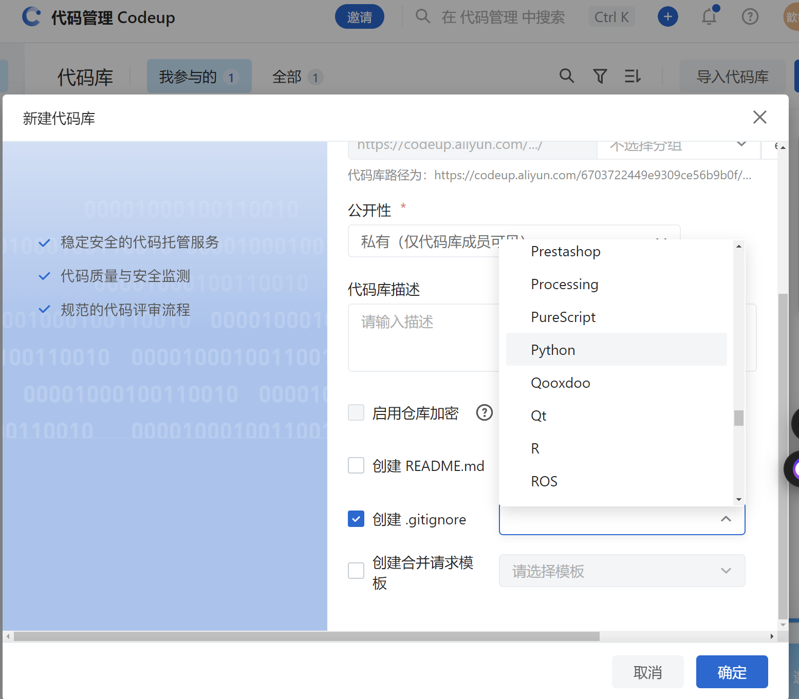
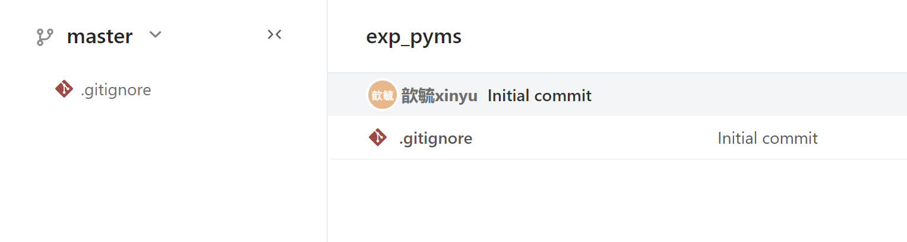

##### 克隆远程仓库至本地仓库

一般支持HTTPS和SSH两种协议。此次首先使用HTTPS协议。

1. 配置HTTPS克隆密码
进入[Codeup](https://codeup.aliyun.com/)系统，右上角选择个人设置，随后进入[HTTPS 密码] 页面配置克隆密码

2. 复制代码库地址（HTTPS URL）
云端进入代码库 exp_pyms 首页，找到代码库地址，选择HTTPS，复制代码库的URL，用于仓库地址，记为 repo_addr 。

3. 克隆远程仓库
本地进入用于存放工作目录的主目录，使用命令git clone 克隆远程仓库。需查看个人设置中的用户名和密码，并在本地终端正确输入远程仓库的用户名和密码，以完成身份验证。
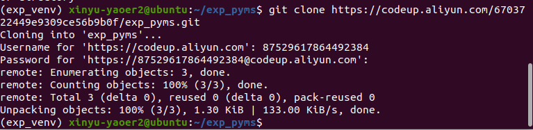
4. 验证
在本地终端输入指令，查看是否克隆成功。
克隆操作会在本地生成工作目录 exp_pyms ，其中包含隐藏目录.git，该目录内容为 Git 仓库核心配置，不可轻易修改，同时也包括云端新建代码库是生成的.gitignore 文件，已被克隆到本地。工作目录exp_pyms 同时还包括远程仓库主分支Master中全部文件的工作副本(WorkingCopy)，当时此时有.gitignore 文件。
操作如图：
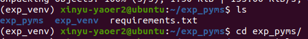
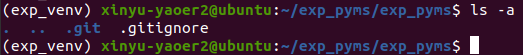

##### 配置本地仓库

按需配置添加 .gitignore 、 Dockerfile 等配置文件以及本地代码文件。本实验中， .gitignore 文件在创建远程仓库时已根据模版生成，并同步到本地，无需再单独添加。此时以 README.md 文件为例说明如何添加文件到本地仓库。

1. 在本地工作目录 exp_pyms 中添加 README.md 文件，内容为实验内容。
2. 执行 git add. 命令，将本地工作目录中所有文件添加到暂存区。
具体操作如图：
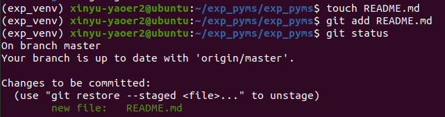

##### 同步本地仓库至远程仓库

执行以下操作，完成后查看远程仓库，已出现本次提交的 README.md 文件

```
# 提交前应养成习惯，先从远程仓库pull最新代码到本地进行冲突检查，当然此时我们这个使用没有冲突。
git pull # 先pull
# 将全部暂存文件提交至本地仓库，当前只有README.md文件
git commit -m "docs: 创建README.md文件"
# 推送本地提交至[远程仓库/分支]，即[origin/master]
git push origin master
```
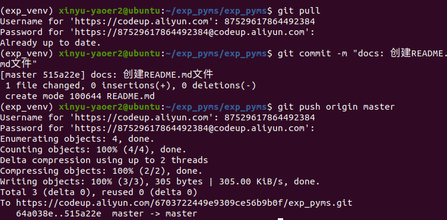

### 使用 SSH 访问远程仓库

*参考文献：[如何配置SSH密钥及自定义SSH认证密钥的路径-云效-阿里云帮助中心](https://help.aliyun.com/zh/yunxiao/user-guide/configure-ssh-key)*
本地环境执行 git pull/push/clone/fetch 等涉及访问远程仓库的命令时，若使用 HTTPS 方式访问，每次均需提供用户名和密码，比较繁琐。一般而言，如果本地开发环境可信，则可以使用**SSH免密认证方式访问**远程仓库，以减少认证交，提高效率。

#### 生成SSH公私钥对

若当前用户 ~/.ssh/ 目录中已存在私钥 id rsa 与公钥 id rsa.pub 文件，直接使用即可。否则使用命令 **ssh-keygen** 新建 SSH 公私钥对，主要参数解析如下：

* -t 指定密钥类型，如 ed25519 或 rsa()
* -f 指定用于存储私钥的文件名，若不使用，则提示默认文件及路径为 ~/.ssh/id_rsa 
* -C 指定注释内容，可用作公钥名称，Codeup称之为[标题]

这里我使用ed25519类型的密钥，使用命令 ssh-keygen -t ed25519 -f ~/.ssh/id_ed25519 -C "id_ed25519" 生成公私钥对，如图所示：
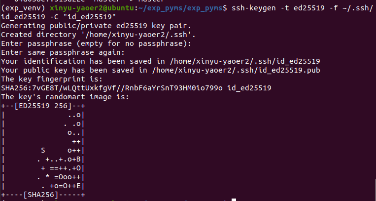

创建成功后，可在当前用户 ~/.ssh/ 目录查看到新建的公钥文件和密钥文件
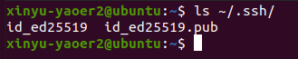

#### 配置远程仓库所需公钥

在本地环境使用 cat 指令查看公钥
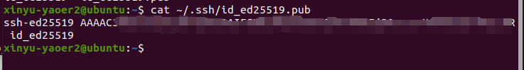

在云端Codeup页面右上角选择「个人设置->SSH 公钥」，粘贴上一步复制的公钥后完成添加。
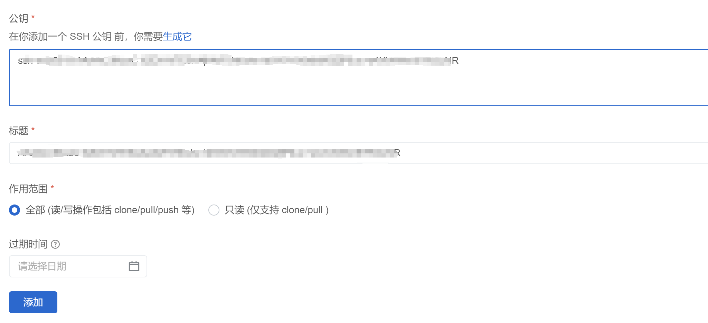

#### chong仓库并重新克隆

重复前面的克隆步骤，重新使用SSH方式克隆代码库。
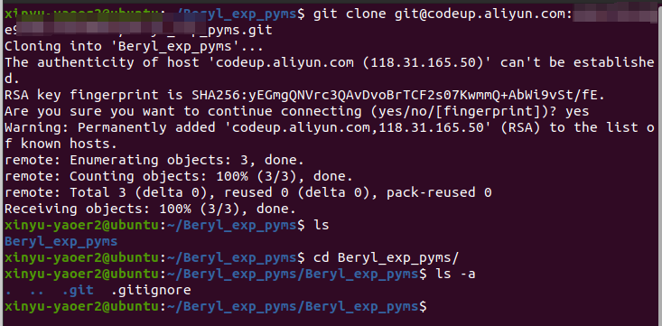
经验证，克隆成功。

### 代码托管基础练习

进入刚刚创建的本地工作目录执行Git基础练习。

#### 创建文件并同步至远程仓库

在本地工作目录 exp_pyms 中创建 test.py 文件，暂存（Stage）至暂存区后使用 git status 命令查看文件状态。
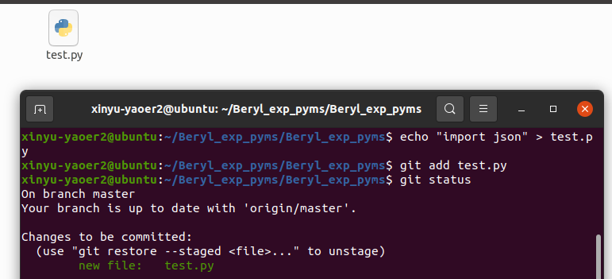

使用 git commit 命令提交至本地仓库并观察文件状态
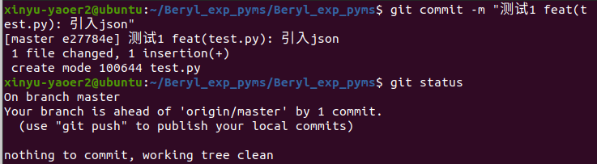

使用 git push 命令同步至远程仓库并观察文件状态
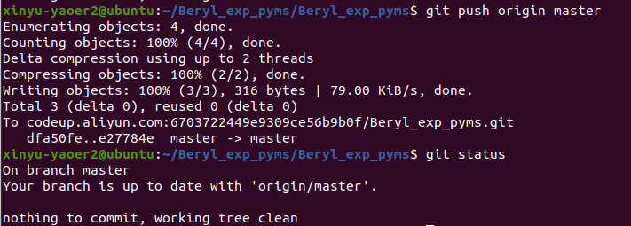

此时，已新建 test.py 文件，并完成「暂存、提交、推送」三个基本操作，将本地代码同步托管到云端 Codeup。

#### 修改文件并同步至远程仓库

修改 test.py 文件，添加一行代码，然后执行 git status 命令查看文件状态。
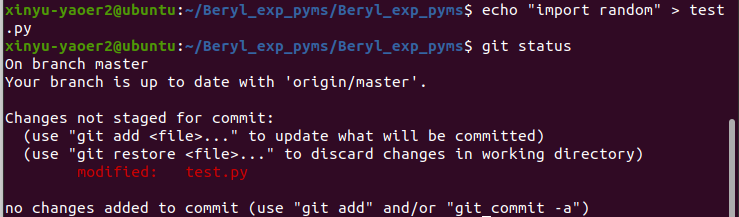
由此可见， test.py在工作录中的状态为被跟踪（Tracked），但修改尚未被暂存（Not Staged），必须再次使用 git add 指令暂存该文件，随后方可再次提交。
*另外需要注意的是，该文件已经使用了add命令，被add的文件就已经被跟踪，再次使用add命令，才会将修改的内容再次添加到暂存区。*
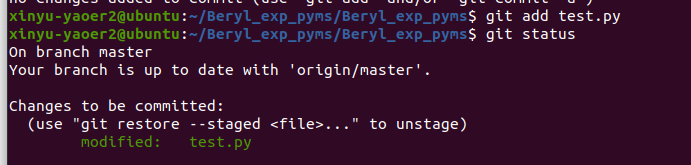

随后修订 test.py ，新增一条语句后再次观察文件状态，可见 test.py 同时具有等待被提交以及尚未保存的内容。显然，刚增加的 import re 属于尚未被暂存的内容。
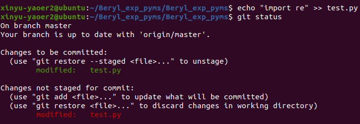

这个时候为了简化操作，使用 git commit 命令并应用-a 参数提交至本地仓库并观察文件状态。
应用 -a 时，Git会自动暂存被修改或删除的文件（未被Git跟踪的文件除外）。
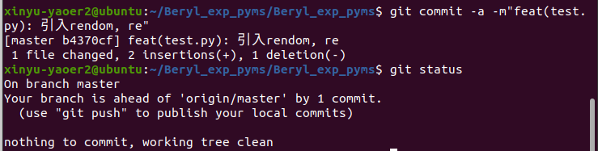

接着直接使用 git push 命令同步至远程仓库并观察文件状态。
*在当前本地 master 分支使用直接使用git push 等价于 git push origin master*
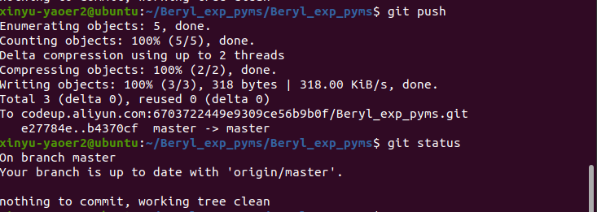
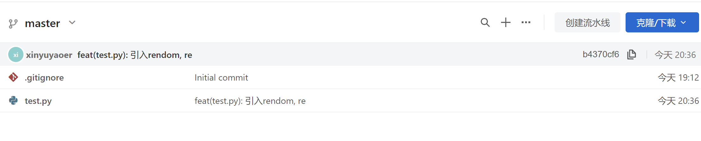
查看远程仓库历史记录确认执行成功。

#### 基于提交历史比较版本差异

git log 命令可以用于查看提交历史记录，具有非常强大的能力。此处先练习基本用法。默认输出按时间先后顺序列出所有的提交，最近的更新排在最上面。输出内容中，commit 后紧跟的是本次提交的 SHA-1 校验和，可作为提交的版本号
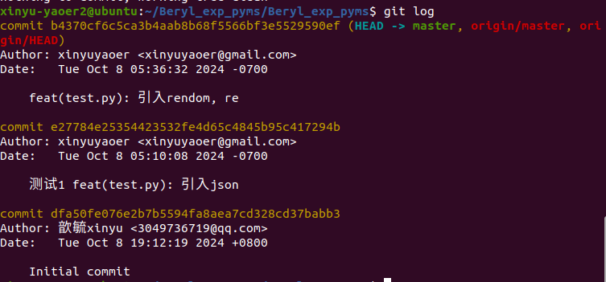

使用 -p 或 --patch 参数查看每次提交所引入的差异，并在其后指定要查看的提交数，如 -1 说明只查看最近的 1 次提交。
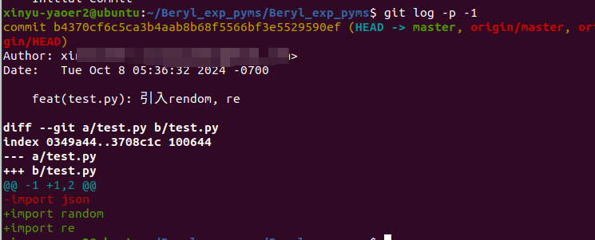

实际编程时，经常会遇到希望将当前版本与过往提交的某个版本进行比较的场景。此时可在 git 1og 查询的基础上使用 **git diff** 查询某过往提交版本与当前工作目录中版本的差异。

* 比较当前版本与指定版本的差异
```
git diff <commit>
```
* 比较指定版本与指定版本的差异
```
git diff <commit1> <commit2>
```
* 比较当前版本与指定版本的差异，仅显示差异部分
```
git diff <commit> --stat
```
实验中，先修改test.py, 然后将test.py当前工作目录中的版本与SHA-1校验和为「394ea07...」的历史提交版本比较。
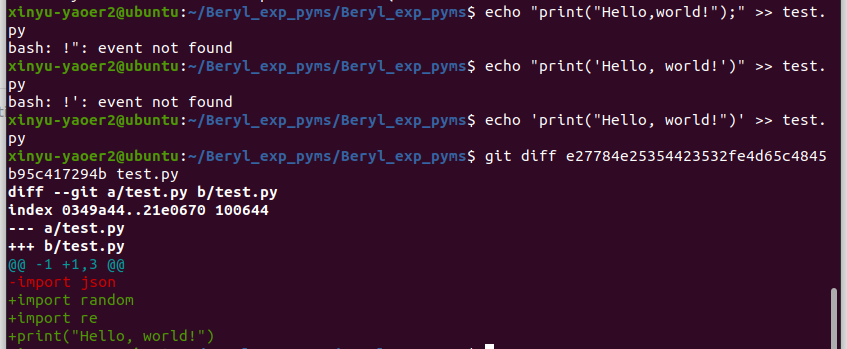
从图中可以发现，在 Bash 中, ！有特殊含义，如果它不是在特定的命令历史扩展等上下文中正确使用，就会出现 “event not found” 错误。
解决方案：①使用 \! 转义 ②里面的内容使用单引号括起来，即：echo 'print("Hello, world!")' >> test.py
解释:smile:：这是因为在 Bash 中，使用双引号时，Bash 会尝试对一些特殊字符（如 $、!、* 等）进行解析和扩展。而使用单引号时，Bash 会将单引号中的内容视为完全的字面字符串，不进行任何特殊字符的解析和扩展。
echo "print("Hello,world!");" >> test.py 这个命令中，双引号内的字符串包含了双引号和括号，Bash 可能会尝试对其进行不适当的解析，导致错误。而 echo 'print("Hello, world!")' >> test.py 中，单引号确保了整个字符串被视为纯文本，不会触发 Bash 的特殊字符解析机制，所以能够正确执行。

#### 按需撤销暂存、提交或推送

* **撤销暂存**
查看文件状态，确认 test.py 修订为暂存，随后执行暂存并再次查看文件状态
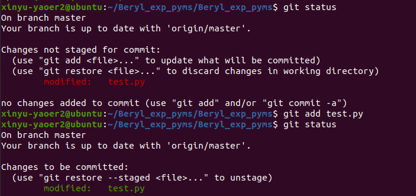
此时可见系统提示 (use "git restore --staged <file>..." to unstage), 应用该指令后观察文件状态，发现 test.py 状态恢复为尚未暂存(Modified by Not Staged)。该命令的本意是[To restore a file in the index to match the version in HEAD ]

所以接下来输出下面的指令：

```
git restore --staged <file> # 将提交区（代码仓库）中HEAD指向的版本复制到暂存区
git status # 查看状态
```
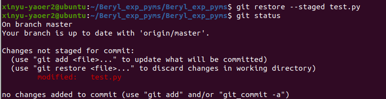
也可以使用命令 git reset HEAD <file> 来取消对 test.py 的暂存。需要特别注意的是，若该指令重复执行，将会**依次取消**对于test.py的历史提交，是非常危险的命令，**必须慎用**。
```
git add test.py # 重新暂存文件git status # 查看状态
git reset HEAD test.py # 取消暂存
git status # 查看状态
```
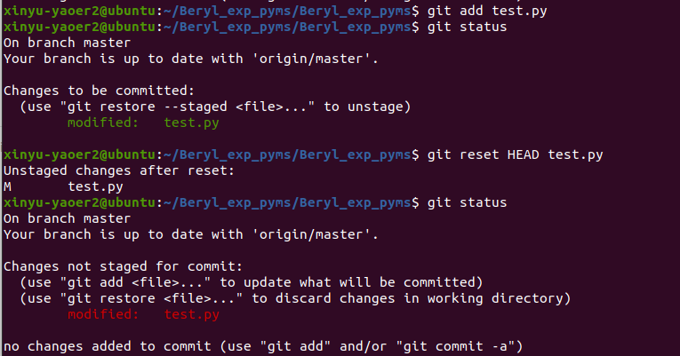

* **撤销提交**
提交当前包含打印 Hello，world! 语句的 test.py 并查看文件状态。
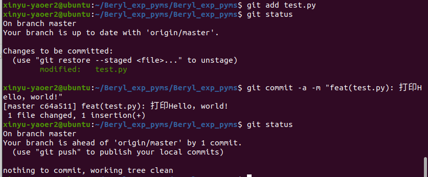
使用命令 git reset HEAD~ 撤销提交后査看文件状态，可发现 test.py 已恢复到尚未暂存与提交的状态。
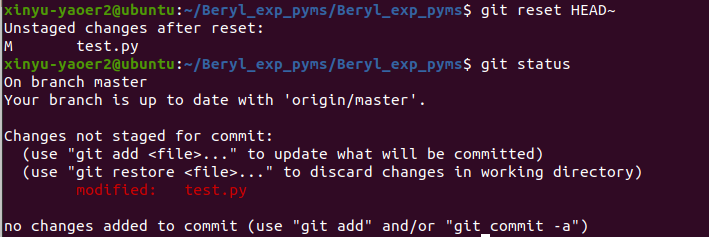
**注意：如若 git reset HEAD~重复执行，会造成 HEAD 不断偏移，谨慎使用!**

* **撤销推送**
本地回滚 HEAD 后强制推送远程仓库，等价于撤销先前的推送。
但是经过了解，本地回滚 HEAD 后强制推送远程仓库在一定程度上可以使远程仓库状态恢复到较早版本，类似撤销先前推送的部分效果。但这种操作可能会给协同开发者带来严重冲突，且并非真正意义上的撤销推送，只是用旧版本覆盖新版本，应谨慎使用并提前与团队成员沟通协调。
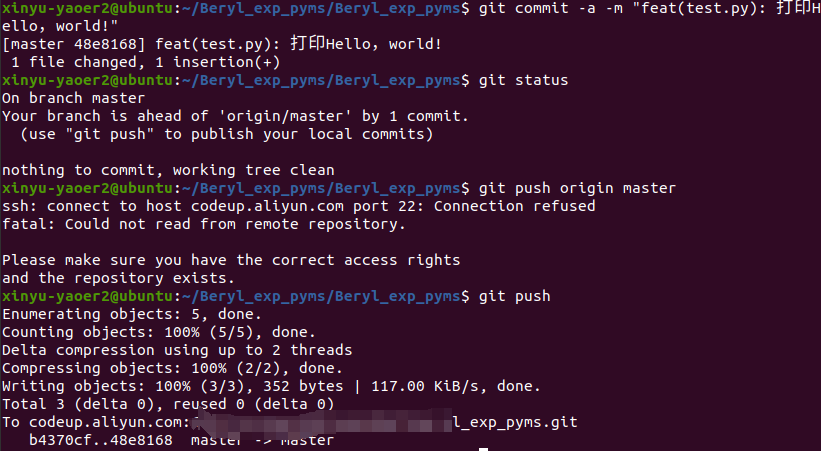
执行以上操作后登陆Codeup，查看远程仓库 master 分支「提交」页面，可见本次新提交记录。
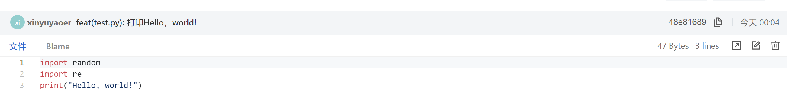
输入以下指令用来撤销推送：
```
git reset HEAD~ # 撤销提交（本地回滚 HEAD）
git push origin master --force # 强制推送到远程仓库
#或者用：git push -f origin master # 强制推送到远程仓库
```
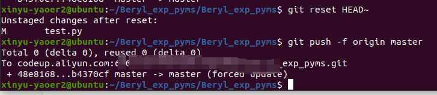
执行以上操作后登陆 Codeup，查看远程仓库 master 分支「提交」页面，可见本次新提交记录。
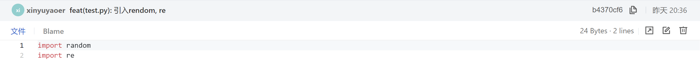

**注意：** 因为 git push -f 会强行推送，并抹去上次推送的全部内容非常危险:cry:！强制推送应该谨慎使用，因为它可能会导致其他从该远程仓库拉取代码的人出现问题，覆盖他们的工作成果并造成混乱。如果可能，应该尽量通过更安全的方式（如先拉取远程分支进行合并等）来同步代码，而不是频繁使用强制推送。

#### 删除文件以及恢复指定文件

##### 保留文件，取消跟踪
```
git status # 查看现在的状态，发现有部分内容没有被add，即没有被跟踪
git add test.py # 全部跟踪
git status
git rm --cached test.py # 取消对test.py的跟踪
git status
git add test.py # 再次跟踪
git status
```
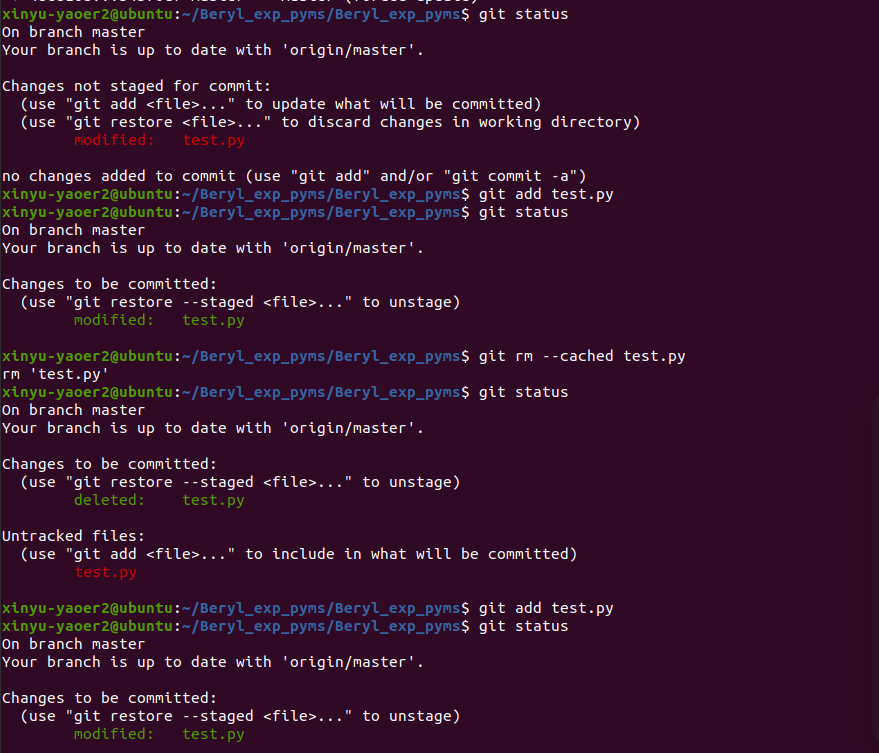

##### 从暂存区域恢复文件
修订文件，暂存，随后删除文件但并不暂存删除操作，可将暂存区域 index 暂存的版本恢复到工作目录。